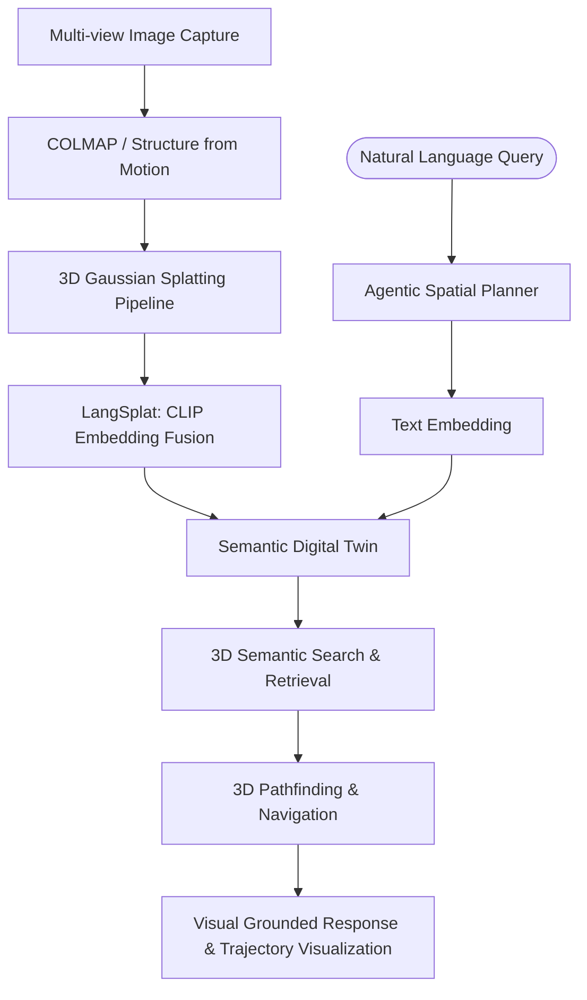

# Neuro-Splat: Agentic 3D Scene Reconstruction & Semantic Understanding

## Project Overview

**Neuro-Splat** is a production-grade spatial intelligence system that bridges the gap between 2D computer vision and 3D physical reality. This project involves reconstructing high-fidelity 3D environments from images using **3D Gaussian Splatting (3DGS)** and deploying an autonomous agent capable of deep semantic reasoning and spatial navigation within the reconstructed scene.

By "baking" **CLIP (Contrastive Language-Image Pre-training)** embeddings directly into 3D Gaussians, the system creates a "Semantic Digital Twin" where every point in space is associated with high-level language concepts.

### Why This Project?

1.  **Spatial Intelligence Frontier**: Moves beyond "surface-level" agents into 3D geometry and spatial relationships.
2.  **SOTA Research Implementation**: Implements paradigms from the latest 2024-2025 papers like **LangSplat**, **LERF**, and **Splat-SLAM**.
3.  **Cross-Domain Impact**: Highly relevant to autonomous robotics (Boston Dynamics style), Augmented Reality (Meta Orion), and Digital Twins (NVIDIA Omniverse).
4.  **High Complexity**: Combines **3D Reconstruction**, **Point-Cloud Semantics**, and **Agentic Planning** (LangGraph).

---

## Technical Architecture

### System Components

### Core Modules

#### 1. 3D Gaussian Splatting (3DGS) Pipeline

- **Scene Reconstruction**: Uses 3DGS to represent scenes as a collection of 3D Gaussians (Position, Rotation, Scale, Opacity, Color).
- **Performance**: Real-time rendering at 100+ FPS, significantly faster and clearer than traditional NeRFs.
- **Data Source**: COLMAP processed multi-view images (e.g., from personal workspace or outdoor environment).

#### 2. Semantic Grounding (LangSplat/LERF)

- **CLIP Feature Extraction**: Extracts multi-scale visual features from the original images.
- **Embedding Fusion**: Projects 2-D CLIP features into the 3D-Gaussian space.
- **Language Alignment**: Enables text-to-3D queries by calculating the cosine similarity between user queries and the semantic embeddings within the splats.

#### 3. Agentic Layer (LangGraph)

- **Spatial Reasoning**: The agent decomposes complex queries (e.g., _"Find the item I use for drinking and tell me how close it is to the charger"_) into spatial primitives.
- **Recursive Search**: If an object isn't immediately found, the agent plans a multi-hop visual search pattern through the 3D space.
- **Environment Interaction**: Simulated pathfinding using A* or RRT* algorithms within the 3D occupancy map derived from the splats.

---

## Implementation Plan (4-Week Research & Dev)

### Week 1: 3D Reconstruction Phase

- [ ] Capture 30-50 high-quality images of a structured environment (e.g., home office).
- [ ] Process images via **COLMAP** to generate camera poses and sparse points.
- [ ] Run the **3DGS training** pipeline to achieve photorealistic reconstruction.
- [ ] **Deliverable**: A functional 3D splat file (`.ply`) viewable in standard splat viewers.

### Week 2: Semantic Infusion (SOTA Implementation)

- [ ] Implement the **LangSplat** framework: extracting hierarchical CLIP features.
- [ ] Map 2D features to 3D Gaussians using weighted averaging or MLP projection.
- [ ] Build a search utility to highlight "Hotspots" in the 3D scene based on text queries.
- [ ] **Deliverable**: A "Semantic Map" where typing "phone" highlights the 3D area of the phone.

### Week 3: Agentic Reasoning & Planning

- [ ] Integrate **LangGraph** as the central "brain."
- [ ] Implement the `Spatial Planner` node: converts text to 3D search coordinates.
- [ ] Develop the `Trajectory Planner` node: generates a fly-through path to the target object.
- [ ] Implement the `Reasoning` node: explains the spatial relationship (e.g., "left of," "inside").
- [ ] **Deliverable**: A CLI/GUI where the agent "flies" to an object upon request.

### Week 4: GUI & Walkthrough Documentation

- [ ] Build a **Three.js** or **Gradio-based** 3D viewer for the portfolio.
- [ ] Record a high-quality demo showing the agent navigating the 3D space.
- [ ] Write a detailed Springer LNCS style technical report.
- [ ] **Deliverable**: Production-ready GitHub repo, interactive demo, and Zenodo pre-print.

---

## Technical Stack

- **3D Vision**: COLMAP, 3D Gaussian Splatting (Original PyTorch implementation), gsplat.
- **Semantics**: OpenAI CLIP, Hugging Face Transformers.
- **Agency**: LangGraph, LangChain.
- **Mathematics**: PyTorch, NumPy (Linear algebra, coordinate transformations).
- **Frontend**: Three.js (for web visualization), Gradio (for prototyping).

---

## Resume Bullet Points (Draft)

> **Neuro-Splat: Agentic 3D Scene Reconstruction & Semantic Understanding**
>
> - Architected a spatial intelligence system using **3D Gaussian Splatting (3DGS)** and **LangSplat**, infusing 3D geometry with **CLIP-based semantic embeddings** for real-time text-to-3D search.
> - Designed an autonomous agent via **LangGraph** capable of **Spatial Reasoning** and trajectory planning, enabling the system to localize and describe objects within a 3D "Digital Twin" with sub-meter precision.
